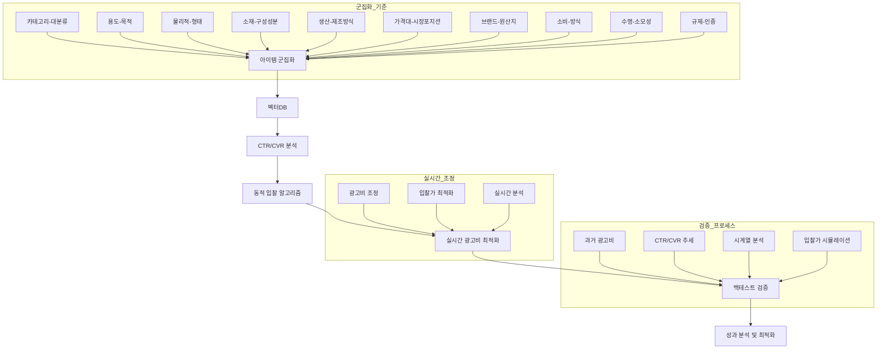

# AutoBid Bot 프로젝트

이 프로젝트는 벡터DB 기반 아이템 군집화와 CTR/CVR 분석을 통한 광고비 최적화 시스템을 구현하는 연구 및 개발 프로젝트입니다.

## 프로젝트 개요

### 핵심 기능
1. **아이템 군집화**
   - 10개 기준에 따른 상품 분류 (카테고리, 용도/목적, 물리적 형태 등)
   - 벡터DB를 활용한 유사 상품 그룹화
   - 군집별 특성 분석

2. **CTR/CVR 분석**
   - 군집별 클릭률(CTR)과 전환율(CVR) 분석
   - 트렌드 기반 광고비 최적화 전략 수립
   - 실시간 성과 모니터링

3. **동적 입찰 시스템**
   - 실시간 입찰가 조정 알고리즘
   - CTR/CVR 추세 기반 광고비 최적화
   - 백테스트를 통한 전략 검증

## 프로젝트 구조

### 1. 입찰구조
- 입찰 주기.md: 입찰 시스템의 주기적 특성 분석
- 품질 점수 산식.md: 입찰 품질 평가를 위한 점수 산정 방식
- 평가 지표.md: 입찰 성능 평가를 위한 지표 분석
- 결론.md: 입찰 구조 분석 결과 요약

### 2. 평가지표
- CTR,CVR 비율.md: 클릭률과 전환률의 관계 분석
- 결론.md: 평가지표 분석 결과 요약

### 3. 학습방향
- 아키텍쳐.md: 시스템 아키텍처 설계
- 광고비 전략.md: 광고비 최적화 전략

### 4. 벡테스트의 한계
- 한계 요인.md: 벡테스트의 제한사항 분석
- 해결 방안.md: 한계 극복을 위한 접근 방법
- 예상 동작.md: 시스템의 예상 동작 시나리오

### 5. 실구현 설계
- 학습/: 머신러닝 모델 학습 관련 구현
- 벡터화/: 데이터 벡터화 처리 구현

### 6. 가능성 연구
- 학습/: 추가 학습 모델 연구
- 벡터화/: 고도화된 벡터화 방법 연구

## 기술 스택
- Python
- 벡터DB
- 머신러닝/딥러닝
- 데이터 분석
- 실시간 처리 시스템

## 시스템 아키텍처

## 주요 성과
- 벡터DB 기반 아이템 군집화 시스템 구축
- CTR/CVR 분석을 통한 광고비 최적화 전략 수립
- 동적 입찰 알고리즘 개발
- 백테스트를 통한 전략 검증 시스템 구현

## 향후 계획
- 벡터DB 데이터 축적을 통한 분석 정확도 향상
- 실시간 처리 시스템 고도화
- 새로운 군집화 기준 연구
- AI 모델 성능 개선 